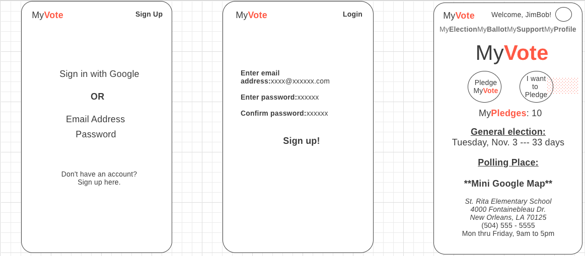
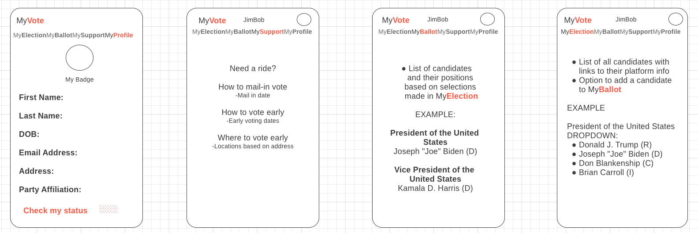
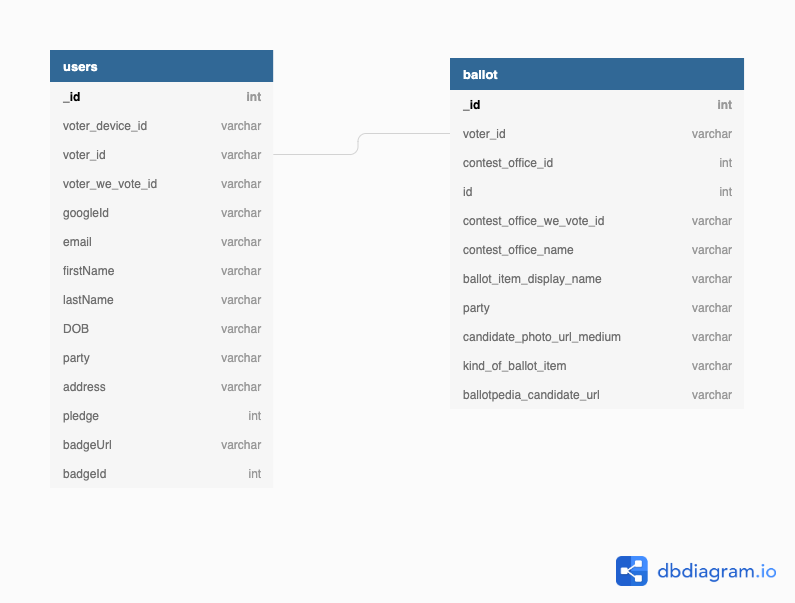
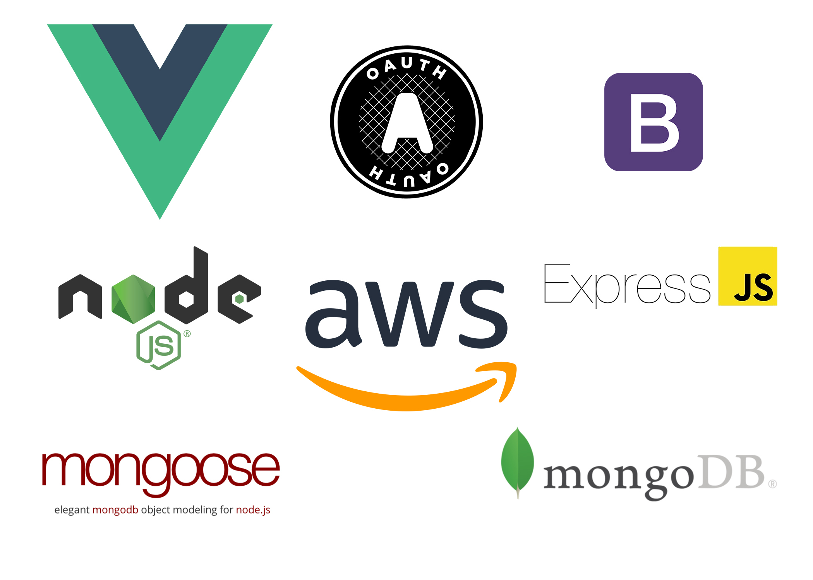

# myvote

<!-- # MyVote
### Candidate information at your fingertips -->

## Team (Hanging Chads)

- Product Owner: Kristiana Llanos (Backend, Frontend)
- Scrum Master: Scott Anderson (Backend, Frontend)
- Lead Engineer: Jon Tenholder (Backend, Frontend)

---

## MyVote

Created during one of America's most important election cycles, MyVote aims to make gathering information on voting as easy and simple as possible. MyVote employs a public voter information query API to collect and display information on the election and voting process.

- Pledge your vote on your friend's pages
- Watch as your friends pledge to vote on your page
- Collect badges as more of your friends pledge to vote
- Find your local polling place and search rideshare options to help you get to the polls

_All this and more with MyVote!_

---

# Table of Contents

1. [Wireframes](#wireframes)
2. [Schema](#schema)
3. [Tech Stack](#tech-stack)

### Wireframes

### Schema

### Tech Stack

### MongoDB Atlas setup

- Create new Cluster named myvotecluster
- Create a new Database user
  - under Database Access, add new database user
  - give user read and write any database access
- Add IP access
  - under Network Access, add ip address
  - add your current ip address
